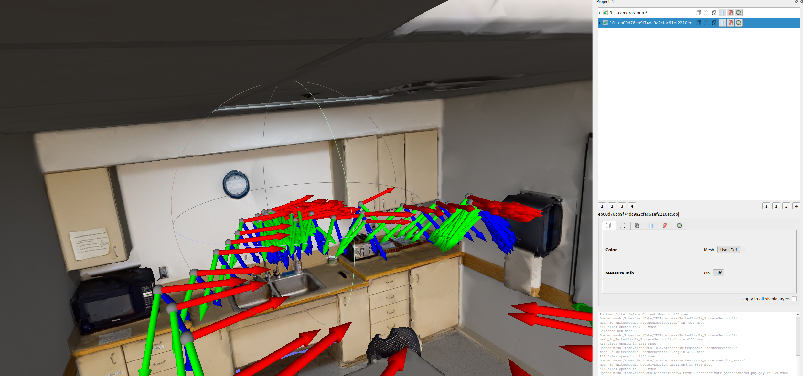

## Egocentric video relocalization pipeline

* Step 1: Prepare a 3d scan folder with images, poses, 3d meshes, point cloud in [here](data/scan) and an egocentric video with images in [here](data/egovideo).
Data can be downloaded [here]().

* Step 2: run the following script for a relocalization of the egocentric video w.r.t the 3d scan mesh as:

`./main.sh ./data/scan/ ./data/egovideo/`

This will output 2 main files:

        1. ./data/egovideo/poses_reloc/camera_poses_pnp.npy
   
This is an ndarray of size (Nx3x4) where N is the number of egocentric images which stores the transformation from scans to camera coordinate.

        2. ./data/egovideo/poses_reloc/good_poses_pnp.npy
   
This is an ndarray of size (N,) where N is the number of egocentric images. 

* Step 3: Visualize the output with meshlab.
Add the following file to meshlab:
    1. /path/to/egocentric_video/poses_reloc/cameras_pnp.ply
    2. /path/to/3dscans/matterpak/*.obj

